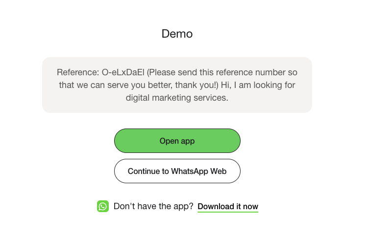

# Correlation ID

**How we track and link anonymous web visitors to WhatsApp conversations.**

## Structure

The Correlation ID is a unique session identifier generated when a user interacts with the widget.

*   **Format**: `O-XXXXXXX` (e.g., `O-aB3dE9z`)
*   **Composition**: The prefix `O-` followed by 7 random alphanumeric characters.
*   **Uniqueness**: Globally unique across the platform.

## Lifecycle & Flow

1.  **Widget Click**: The user clicks the widget on the website.
2.  **Session Check**: We check if this device (`deviceId`) has an existing session from the last 12 hours.
    *   **Returning User**: The existing Correlation ID is reused.
    *   **New User**: A new unique ID is generated.
3.  **Webhook Trigger**: The `widget.click` event is sent to your webhook immediately.
4.  **WhatsApp Handoff**: The user is redirected to WhatsApp with a pre-filled message containing the ID.
    *   **Message**: `Reference: O-aB3dE9z (Please send this reference number...)`
5.  **Correlation**: When the user sends the message, our system parses the ID and links the WhatsApp conversation to the original web session data.



/// caption
A screenshot of the WhatsApp interface showing the pre-filled message with the Correlation ID (`O-XXXXXXX`);
///

## Obtaining the ID

You can obtain the Correlation ID in real-time via our Webhooks or fetch historical data via our API.

### Webhook Payload

Subscribe to the `widget.click` event to receive the ID before the user even sends a message.

```json
{
  "event_type": "widget.click",
  "data": {
    "correlation_id": "O-aB3dE9z",
    "device_id": "...",
    "click_url": "https://example.com/landing",
    "parsed_params": {
      "utm_source": "google"
    },
    "user_agent": "...",
    "ip_address": "..."
  }
}
```

### Attribution History API

You can fetch the past correlation history using the **Attribution Logs** endpoint. This is useful for auditing and reconciling data within your own system.

**Endpoint**: `GET /integrations/external/attribution`

```bash title="Request"
curl -X GET \
  "https://chatbot-api.oomdigital.com/integrations/external/attribution?limit=5" \
  -H "Authorization: Bearer <YOUR_AURIX_API_KEY>"
```

```json title="Response"
{
  "status": 200,
  "message": "ok",
  "data": [
    {
      "correlation_id": "O-PimWNfy",
      "device_id": "16e1d281-9fc7-48fa-b34c-2dbac4ae4879",
      "created_at": "2026-01-07T09:52:24.744651Z",
      "correlated_at": "2026-01-07T09:53:40.377977Z",
      "click_url": "https://app.aurix.com.sg/auth/login",
      "parsed_params": {},
      "ip_address": "101.100.185.9",
      "user_agent": "Mozilla/5.0 (Macintosh; Intel Mac OS X 10_15_7) AppleWebKit/537.36 (KHTML, like Gecko) Chrome/143.0.0.0 Safari/537.36",
      "lead_type": null
    },
    {
      "correlation_id": "O-nJrY6B3",
      "device_id": "cfc2b353-2f46-4c0b-a473-1efc196fc98d",
      "created_at": "2026-01-07T09:34:27.074392Z",
      "correlated_at": null,
      "click_url": "https://app.aurix.com.sg/auth/login",
      "parsed_params": {},
      "ip_address": "101.100.185.9",
      "user_agent": "Mozilla/5.0 (Macintosh; Intel Mac OS X 10_15_7) AppleWebKit/537.36 (KHTML, like Gecko) Chrome/143.0.0.0 Safari/537.36",
      "lead_type": null
    }
  ]
}
```