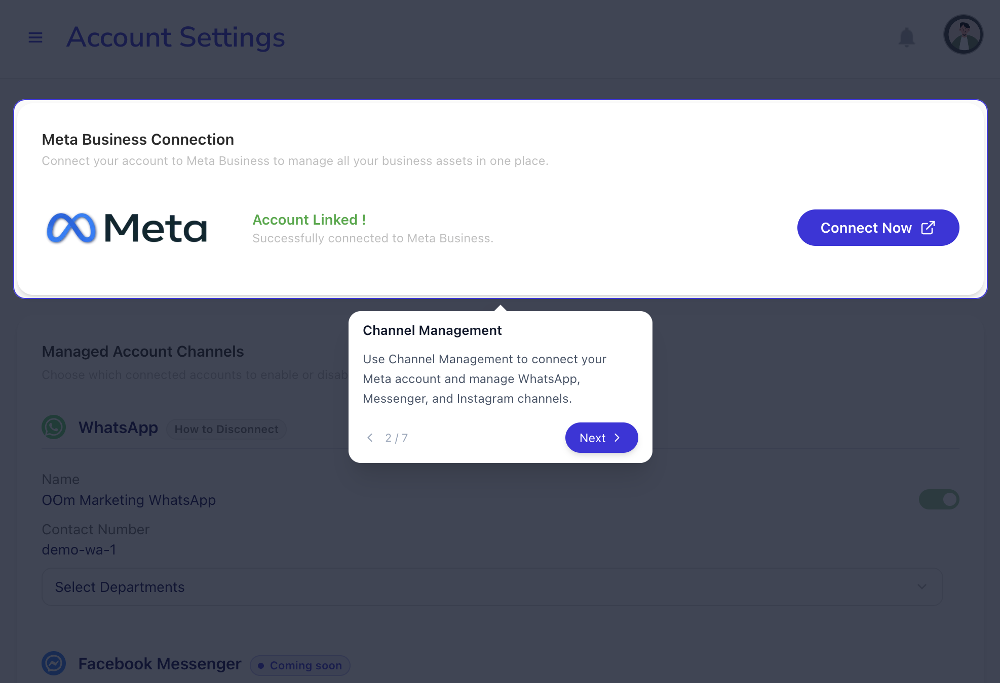
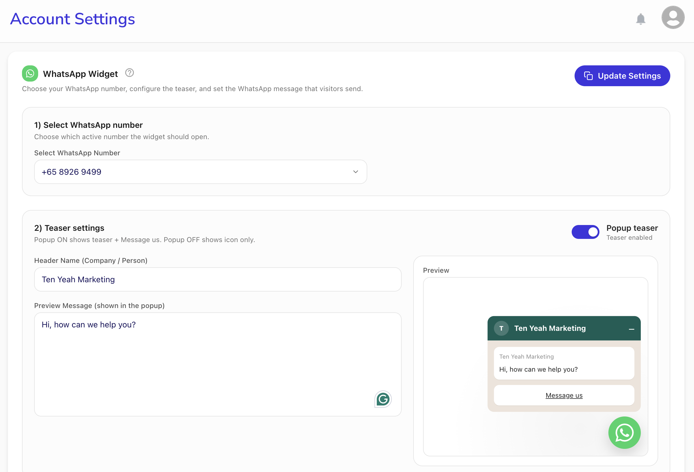
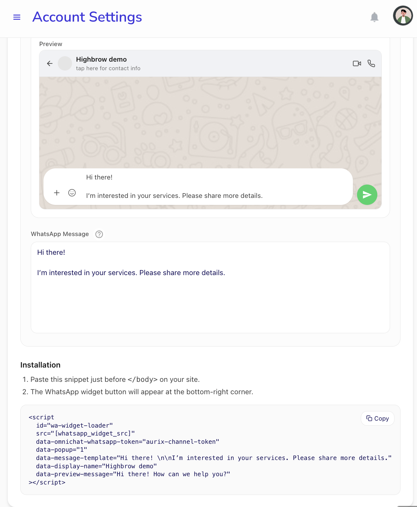

# WhatsApp Widget Setup

The WhatsApp Widget allows your website visitors to start a conversation with your team directly via WhatsApp. This tutorial covers how to connect your channel, customize the widget's appearance, and embed it on your website.

## Prerequisites

Before setting up the widget, ensure you have:

*   An active WhatsApp Business account.
*   Access to your website's source code or CMS (e.g., Webflow, Next.js).

---

## Step 1: Connect Your WhatsApp Channel

To use the widget, you must first connect your WhatsApp number through Meta Business.

1.  Navigate to **Account Settings** and select the **Channel Management** tab.
2.  Click **Connect Now** in the Meta Business Connection section.
3.  Follow the Meta authentication flow to link your account.
4.  Once linked, your WhatsApp numbers will appear under **Managed Account Channels**.
5.  **Activate** the number you wish to use by clicking the toggle switch.



/// caption
The Channel Management interface where you connect Meta and activate your WhatsApp numbers.
///

!!! tip "Routing to Departments"
    You can link specific WhatsApp numbers to different departments (e.g., Sales, Support) to ensure incoming messages are routed to the correct team members.

---

## Step 2: Customize Your Widget

After activating your number, you can customize how the widget appears to your visitors.

1.  Go to the **WhatsApp Widget** tab in Account Settings.
2.  **Select your WhatsApp Number** from the dropdown menu.


/// caption
Select your active number to begin configuring your widget's appearance and behavior.
///

3.  Configure the **Teaser Settings**:
    *   **Popup teaser (ON)**: Displays a header name, a preview message, and a "Message us" button.
    *   **Popup teaser (OFF)**: Displays only the floating WhatsApp icon.
4.  **Header Name**: Enter your company or department name.
5.  **Preview Message**: Write a short greeting to encourage visitors to chat.
6.  **WhatsApp Pre-filled Message**: Define the message that will be automatically typed for the user when they open WhatsApp.
7.  Click **Save Settings** to finalize your configuration.

---

## Step 3: Technical Installation

The final step is to embed the widget script into your website.

1.  Scroll to the **Installation** section at the bottom of the page.
2.  Copy the generated **Script Snippet**.


/// caption
Copy your unique script snippet from the Installation section.
///

3.  Paste the snippet just before the closing `#!html </body>` tag on every page where you want the widget to appear.

### Platform-Specific Guides

Different platforms (Shopify, WordPress, etc.) have different methods for inserting custom scripts. The key is to inject the snippet into the correct location. 

!!! info "Consulting Your Developer"
    If the integration does not work as expected, consult your website developer. Show them the script snippet and ask them where it should be injected for your specific platform. They just need to ensure the script is loaded and the data attributes are correctly preserved.

=== "Standard HTML"

    Paste the script at the end of your HTML file:

    ``` html
    <body>
      <!-- Your content -->
      <script
        id="wa-widget-loader"
        src="[whatsapp_widget_src]"
        data-omnichat-whatsapp-token="YOUR_TOKEN"
        data-popup="1"
        data-message-template="Hello! I have a question."
        data-display-name="Support Team"
        data-preview-message="How can we help you today?"
      ></script>
    </body>
    ```

=== "Next.js"

    Incorporate the widget using the `next/script` component in your `layout.tsx` or `_app.js`:

    ``` tsx title="layout.tsx"
    import Script from 'next/script'

    export default function RootLayout({ children }) {
      return (
        <html lang="en">
          <body>
            {children}
            <Script
              id="wa-widget-loader"
              src="[whatsapp_widget_src]"
              data-omnichat-whatsapp-token="YOUR_TOKEN" // (1)!
              data-popup="1"
              data-message-template="Hello! I have a question."
              data-display-name="Support Team"
              data-preview-message="How can we help you today?"
              strategy="afterInteractive"
            />
          </body>
        </html>
      )
    }
    ```

    1.  :key: Replace `YOUR_TOKEN` with the unique token generated in your dashboard.

---

## Troubleshooting

??? question "The widget isn't appearing on my site"
    *   Ensure the WhatsApp number is **active** in Channel Management.
    *   Verify that the script is placed correctly before the `</body>` tag.
    *   Ensure the `data-omnichat-whatsapp-token` matches the one in your dashboard exactly.

??? question "I updated my settings in the dashboard, but the widget hasn't changed"
    *   **Caching**: Your browser or website may be caching an older version of the script. Try clearing your browser cache or viewing the site in an Incognito/Private window.
    *   **Saving**: Ensure you clicked **Update/Save Settings** in the dashboard after making changes.
    *   **Number Change**: If you switched to a different WhatsApp number, you **must** copy the new script snippet and update it on your website, as the token is unique to each number.

??? question "The widget overlaps with other elements on my site"
    *   The widget is positioned at the bottom-right by default. If it overlaps with other site elements (like "Back to Top" buttons), you may need to consult your developer to adjust the CSS positioning of either the widget or the conflicting element.

??? question "Can I use multiple numbers on one site?"
    Currently, the widget is designed to use one primary WhatsApp number per installation. To change numbers, update the settings in your dashboard and the widget will reflect the changes automatically, you will need to copy the new configuration and repeat the installation steps again; 
